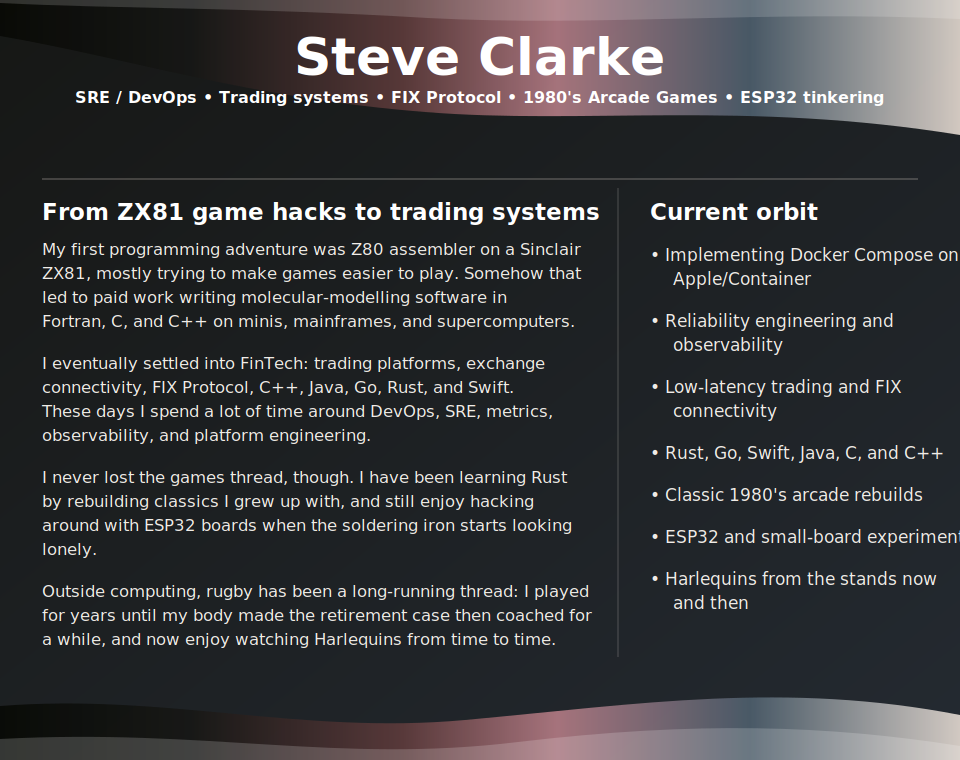

  

  
  
  
  

<table align="center">
  <tr>
    <td width="68%" valign="top">
      <h3>Tech Stack</h3>
      

        
      

    </td>
    <td width="32%" valign="middle">
      <h3>Buy Me a Coffee</h3>
      

        
      

      

        If you like the projects here, a coffee or a comment keeps the caffeine and ideas flowing.
      

    </td>
  </tr>
</table>

---

## Things worth a furtle

Six most recently updated public repositories, refreshed every six hours.

<!-- recent-repositories:start -->
<table>
  <tr>
    <td width="50%">
      
    </td>
    <td width="50%">
      
    </td>
  </tr>
  <tr>
    <td width="50%">
      
    </td>
    <td width="50%">
      
    </td>
  </tr>
  <tr>
    <td width="50%">
      
    </td>
    <td width="50%">
      
    </td>
  </tr>
</table>
<!-- recent-repositories:end -->

## Metrics

Generated daily with <a href="https://github.com/lowlighter/metrics">lowlighter/metrics</a>.

<picture>
  
</picture>

  
  

  
  

  
Metrics setup note

  
The workflow expects a repository secret named <code>METRICS_TOKEN</code>. Lowlighter recommends a GitHub personal access token because profile metrics need data that the repository-scoped <code>GITHUB_TOKEN</code> cannot always read.

